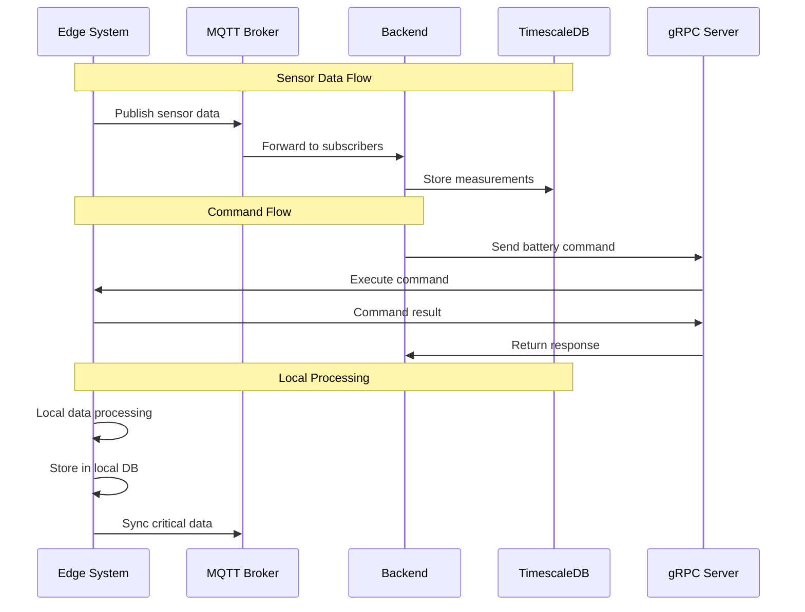
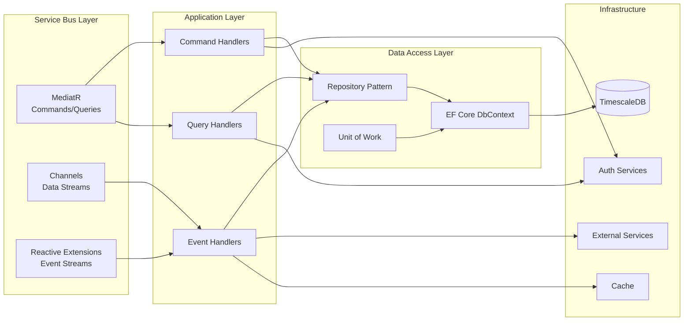
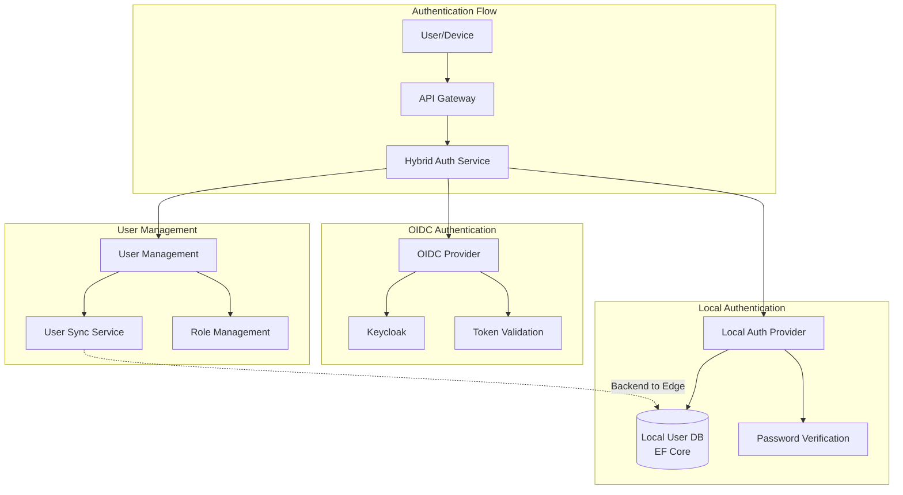
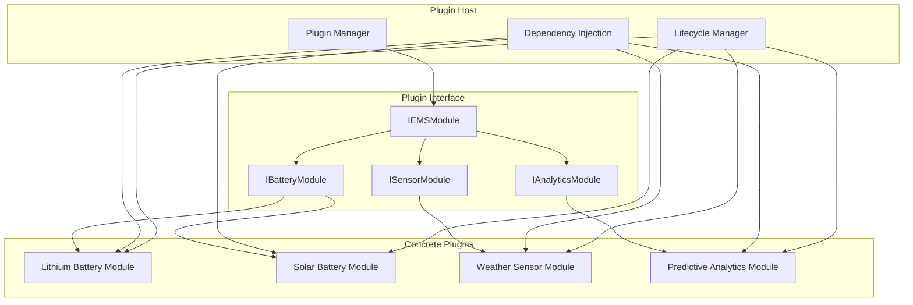
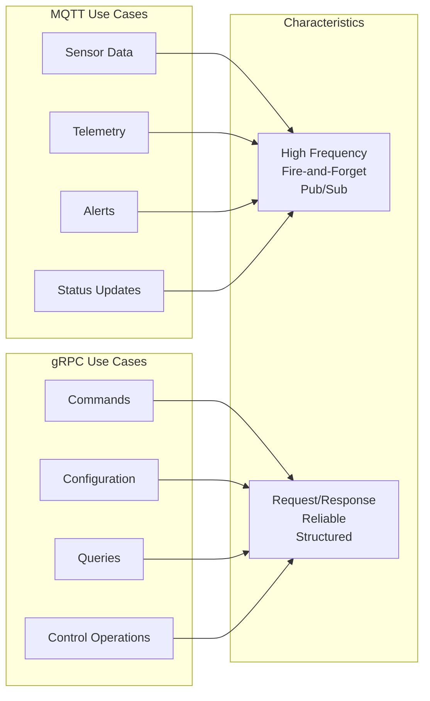

# EMS Core - Architekturdiagramm

## Systemübersicht

```mermaid
graph TB
    subgraph "Backend System"
        API[REST API Gateway]
        SB[Service Bus<br/>MediatR + Channels + Rx]
        DB[(TimescaleDB<br/>PostgreSQL + EF Core)]
        PM[Plugin Manager]
        
        subgraph "Core Services"
            ES[Energy Service]
            BS[Battery Service]
            CS[Configuration Service]
            AS[Hybrid Auth Service]
            US[User Sync Service]
        end
        
        subgraph "Communication Layer"
            MQTT_B[MQTT Broker]
            GRPC_B[gRPC Server]
        end
        
        subgraph "Authentication"
            KC[Keycloak/OIDC]
            LA[Local Auth]
            JWT[JWT Service]
        end
        
        subgraph "Data Layer"
            EFC[EF Core DbContext]
            REPO[Repository Pattern]
            MIGR[Migrations]
        end
        
        subgraph "Plugins"
            BM[Battery Module]
            WM[Weather Module]
            AM[Analytics Module]
        end
    end
    
    subgraph "Edge System 1"
        subgraph "Edge Services"
            ES1[Energy Service]
            BS1[Battery Service]
            CS1[Configuration Service]
            AS1[Hybrid Auth Service]
        end
        
        subgraph "Edge Communication"
            MQTT_E1[MQTT Client]
            GRPC_E1[gRPC Client]
        end
        
        subgraph "Edge Auth"
            LA1[Local Auth]
            US1[User Sync]
        end
        
        subgraph "Edge Data"
            EFC1[EF Core DbContext]
            REPO1[Repository Pattern]
        end
        
        subgraph "Edge Plugins"
            BM1[Battery Module]
            SM1[Sensor Module]
        end
        
        DB1[(Local TimescaleDB<br/>+ EF Core)]
    end
    
    subgraph "Edge System N"
        ES_N[Edge Services]
        MQTT_EN[MQTT Client]
        GRPC_EN[gRPC Client]
        DB_N[(Local TimescaleDB<br/>+ EF Core)]
        AS_N[Hybrid Auth]
    end
    
    subgraph "External Systems"
        BATT[Battery Hardware]
        SENS[Energy Sensors]
        WEATHER[Weather API]
    end
    
    %% Connections
    API --> SB
    SB --> ES
    SB --> BS
    SB --> CS
    SB --> AS
    
    ES --> EFC
    BS --> EFC
    CS --> EFC
    AS --> EFC
    
    EFC --> DB
    REPO --> EFC
    
    AS --> KC
    AS --> LA
    AS --> JWT
    
    PM --> BM
    PM --> WM
    PM --> AM
    
    MQTT_E1 -.->|Sensor Data| MQTT_B
    GRPC_B -.->|Commands/Config| GRPC_E1
    
    MQTT_EN -.->|Sensor Data| MQTT_B
    GRPC_B -.->|Commands/Config| GRPC_EN
    
    %% User Synchronization
    US -.->|User Sync| US1
    US -.->|User Sync| AS_N
    
    BM1 --> BATT
    SM1 --> SENS
    WM --> WEATHER
    
    ES1 --> EFC1
    BS1 --> EFC1
    AS1 --> EFC1
    
    EFC1 --> DB1
    REPO1 --> EFC1
```



## Datenfluss-Diagramm



## Service Bus Architektur mit EF Core



## Authentifizierungs-Architektur



## Plugin-Architektur



## Kommunikationsprotokoll-Matrix



## Deployment-Architektur

```mermaid
graph TB
    subgraph "Cloud/Data Center"
        LB[Load Balancer]
        
        subgraph "Backend Cluster"
            BE1[Backend Instance 1]
            BE2[Backend Instance 2]
            BE3[Backend Instance N]
        end
        
        subgraph "Database Cluster"
            DB_MASTER[(TimescaleDB Master)]
            DB_REPLICA[(TimescaleDB Replica)]
        end
        
        MQTT_CLUSTER[MQTT Cluster]
    end
    
    subgraph "Edge Locations"
        subgraph "Site 1"
            EDGE1[Edge System 1]
            LOCAL_DB1[(Local DB)]
        end
        
        subgraph "Site 2"
            EDGE2[Edge System 2]
            LOCAL_DB2[(Local DB)]
        end
        
        subgraph "Site N"
            EDGE_N[Edge System N]
            LOCAL_DB_N[(Local DB)]
        end
    end
    
    LB --> BE1
    LB --> BE2
    LB --> BE3
    
    BE1 --> DB_MASTER
    BE2 --> DB_MASTER
    BE3 --> DB_MASTER
    
    DB_MASTER --> DB_REPLICA
    
    EDGE1 -.->|MQTT/gRPC| MQTT_CLUSTER
    EDGE2 -.->|MQTT/gRPC| MQTT_CLUSTER
    EDGE_N -.->|MQTT/gRPC| MQTT_CLUSTER
    
    MQTT_CLUSTER --> BE1
    MQTT_CLUSTER --> BE2
    MQTT_CLUSTER --> BE3
    
    EDGE1 --> LOCAL_DB1
    EDGE2 --> LOCAL_DB2
    EDGE_N --> LOCAL_DB_N