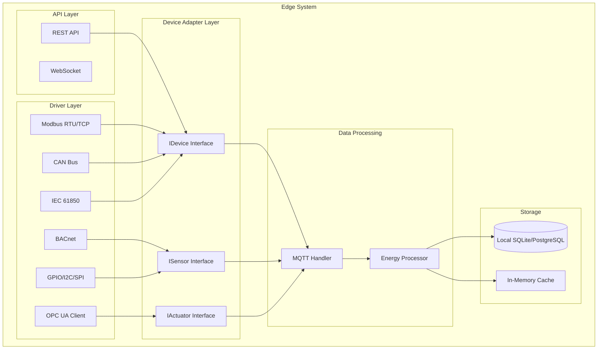
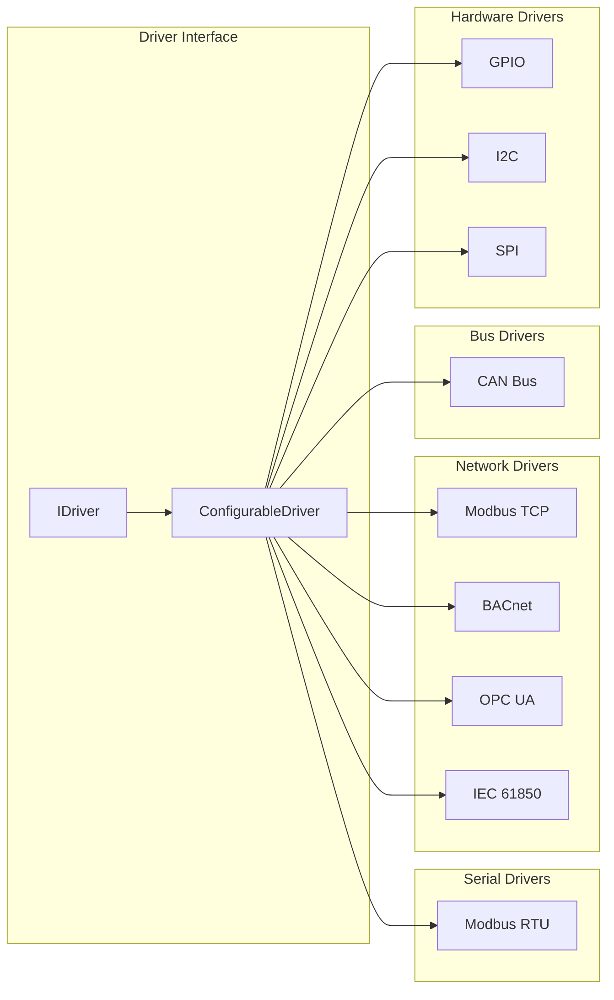
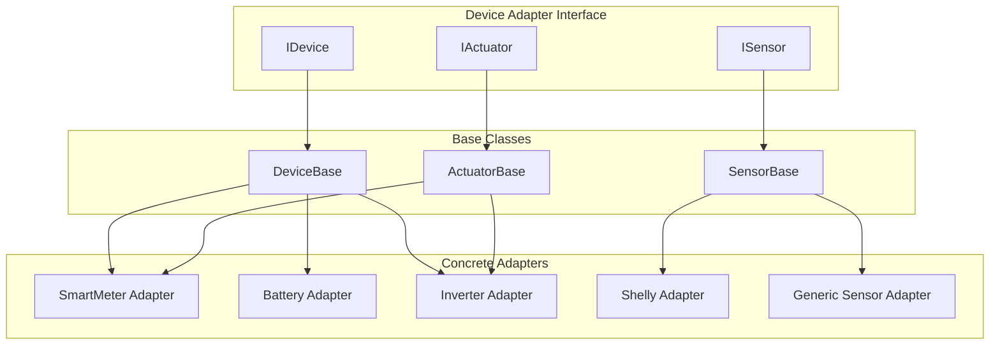

# EMSCore - Verbesserte Spezifikation
## Energie-Management-System (EMS) mit Batterieunterstützung und erweiterbaren Modulen

### Projektbeschreibung

#### Ziel
Entwicklung eines hochskalierbaren Energie-Management-Systems (EMS) mit Batterieunterstützung und Plugin-basierter Erweiterbarkeit. Das System besteht aus einem zentralen Backend und verteilten Edge-Systemen, die über hybride Kommunikationsprotokolle (MQTT + gRPC) verbunden sind. Implementierung in .NET 10 mit TimescaleDB für Zeitreihendaten und einem reaktiven Service Bus.

#### Systemarchitektur

##### Hauptkomponenten
1. **Backend System:** Zentrale Datenverarbeitung, -speicherung und Systemverwaltung
2. **Edge Systems:** Dezentrale Datenerfassung und lokale Verarbeitung mit Offline-Fähigkeiten
3. **All-in-One Mode:** Vereinheitlichte Architektur ermöglicht Backend- und Edge-Funktionalität in einer Instanz

##### Technologie-Stack

###### Core Technologies
- **Framework:** .NET 10 mit ASP.NET Core
- **ORM:** Entity Framework Core 10 mit PostgreSQL Provider
- **Datenbank:** PostgreSQL 16+ mit TimescaleDB 2.14+ Extension
- **Kommunikation:**
  - MQTT 5.0 (Eclipse Mosquitto/HiveMQ) für Telemetriedaten
  - gRPC mit HTTP/2 für Kommandos und Konfiguration
- **Service Bus:** MediatR + System.Threading.Channels + Reactive Extensions (Rx.NET)
- **Authentifizierung:** Hybride Architektur (lokale Konten + Keycloak/OIDC)

###### Infrastructure
- **Containerization:** Docker mit Multi-Stage Builds
- **Orchestration:** Kubernetes (optional) oder Docker Compose
- **Monitoring:** OpenTelemetry + Prometheus + Grafana
- **Logging:** Serilog mit strukturiertem Logging

#### Detaillierte Funktionalitäten

##### 1. Datenverarbeitung und -speicherung mit EF Core

###### EF Core Entities
```csharp
[Table("energy_measurements")]
public class EnergyMeasurement
{
    [Key]
    public long Id { get; set; }
    
    [Column("timestamp")]
    public DateTime Timestamp { get; set; }
    
    [Column("device_id")]
    [MaxLength(100)]
    public string DeviceId { get; set; } = string.Empty;
    
    [Column("site_id")]
    [MaxLength(100)]
    public string SiteId { get; set; } = string.Empty;
    
    [Column("measurement_type")]
    public MeasurementType Type { get; set; }
    
    [Column("value")]
    public double Value { get; set; }
    
    [Column("unit")]
    [MaxLength(20)]
    public string Unit { get; set; } = string.Empty;
    
    [Column("quality_flag")]
    public QualityFlag Quality { get; set; } = QualityFlag.Good;
    
    [Column("metadata")]
    public string? Metadata { get; set; } // JSON String
    
    // Navigation Properties
    public virtual Device Device { get; set; } = null!;
    public virtual Site Site { get; set; } = null!;
}

[Table("devices")]
public class Device
{
    [Key]
    public string Id { get; set; } = string.Empty;
    
    [MaxLength(200)]
    public string Name { get; set; } = string.Empty;
    
    [MaxLength(100)]
    public string Type { get; set; } = string.Empty;
    
    public string SiteId { get; set; } = string.Empty;
    
    public bool IsActive { get; set; } = true;
    
    public DateTime CreatedAt { get; set; }
    
    // Navigation Properties
    public virtual Site Site { get; set; } = null!;
    public virtual ICollection<EnergyMeasurement> Measurements { get; set; } = new List<EnergyMeasurement>();
}

[Table("sites")]
public class Site
{
    [Key]
    public string Id { get; set; } = string.Empty;
    
    [MaxLength(200)]
    public string Name { get; set; } = string.Empty;
    
    [MaxLength(500)]
    public string Location { get; set; } = string.Empty;
    
    public double? Latitude { get; set; }
    public double? Longitude { get; set; }
    
    // Navigation Properties
    public virtual ICollection<Device> Devices { get; set; } = new List<Device>();
}

// EF Core DbContext mit TimescaleDB
public class EMSDbContext : DbContext
{
    public DbSet<EnergyMeasurement> EnergyMeasurements { get; set; }
    public DbSet<Device> Devices { get; set; }
    public DbSet<Site> Sites { get; set; }
    public DbSet<User> Users { get; set; }
    public DbSet<Role> Roles { get; set; }
    public DbSet<UserRole> UserRoles { get; set; }
    
    protected override void OnModelCreating(ModelBuilder modelBuilder)
    {
        // TimescaleDB Hypertable-Konfiguration
        modelBuilder.Entity<EnergyMeasurement>(entity =>
        {
            entity.HasIndex(e => e.Timestamp);
            entity.HasIndex(e => new { e.DeviceId, e.Timestamp });
            entity.HasIndex(e => new { e.SiteId, e.Timestamp });
            
            // Relationships
            entity.HasOne(e => e.Device)
                  .WithMany(d => d.Measurements)
                  .HasForeignKey(e => e.DeviceId);
                  
            entity.HasOne(e => e.Site)
                  .WithMany()
                  .HasForeignKey(e => e.SiteId);
        });
        
        // Device Configuration
        modelBuilder.Entity<Device>(entity =>
        {
            entity.HasOne(d => d.Site)
                  .WithMany(s => s.Devices)
                  .HasForeignKey(d => d.SiteId);
        });
        
        // User Management
        ConfigureUserManagement(modelBuilder);
    }
    
    private void ConfigureUserManagement(ModelBuilder modelBuilder)
    {
        modelBuilder.Entity<User>(entity =>
        {
            entity.HasKey(e => e.Id);
            entity.HasIndex(e => e.Username).IsUnique();
            entity.HasIndex(e => e.Email).IsUnique();
        });
        
        modelBuilder.Entity<UserRole>(entity =>
        {
            entity.HasKey(e => new { e.UserId, e.RoleId });
            entity.HasOne(e => e.User).WithMany(u => u.UserRoles).HasForeignKey(e => e.UserId);
            entity.HasOne(e => e.Role).WithMany(r => r.UserRoles).HasForeignKey(e => e.RoleId);
        });
    }
    
    protected override void OnConfiguring(DbContextOptionsBuilder optionsBuilder)
    {
        optionsBuilder.UseNpgsql(connectionString, options =>
        {
            options.UseTimescale(); // TimescaleDB Extension
        });
    }
}

public enum MeasurementType
{
    Voltage, Current, Power, Frequency, Temperature,
    BatterySOC, BatteryVoltage, SolarIrradiance
}

public enum QualityFlag
{
    Good = 0,
    Uncertain = 1,
    Bad = 2
}
```

###### Repository Pattern mit EF Core
```csharp
public interface IEnergyMeasurementRepository
{
    Task<IEnumerable<EnergyMeasurement>> GetMeasurementsAsync(string deviceId, DateTimeRange range);
    Task<EnergyMeasurement> AddMeasurementAsync(EnergyMeasurement measurement);
    Task<IEnumerable<EnergyMeasurement>> GetAggregatedDataAsync(string deviceId, TimeSpan interval);
    Task<IEnumerable<EnergyMeasurement>> GetSiteDataAsync(string siteId, DateTimeRange range);
}

public class EnergyMeasurementRepository : IEnergyMeasurementRepository
{
    private readonly EMSDbContext _context;
    
    public EnergyMeasurementRepository(EMSDbContext context)
    {
        _context = context;
    }
    
    public async Task<IEnumerable<EnergyMeasurement>> GetMeasurementsAsync(string deviceId, DateTimeRange range)
    {
        return await _context.EnergyMeasurements
            .Where(m => m.DeviceId == deviceId &&
                       m.Timestamp >= range.Start &&
                       m.Timestamp <= range.End)
            .OrderBy(m => m.Timestamp)
            .ToListAsync();
    }
    
    public async Task<IEnumerable<EnergyMeasurement>> GetAggregatedDataAsync(string deviceId, TimeSpan interval)
    {
        // TimescaleDB time_bucket Funktion über Raw SQL
        var sql = @"
            SELECT
                time_bucket(@interval, timestamp) as timestamp,
                device_id,
                measurement_type,
                AVG(value) as value,
                'avg' as unit,
                0 as quality_flag
            FROM energy_measurements
            WHERE device_id = @deviceId
            GROUP BY time_bucket(@interval, timestamp), device_id, measurement_type
            ORDER BY timestamp";
            
        return await _context.EnergyMeasurements
            .FromSqlRaw(sql, interval, deviceId)
            .ToListAsync();
    }
}
```

##### 2. Hybride Kommunikationsarchitektur

###### MQTT Implementation
```csharp
public interface IMqttService
{
    Task PublishAsync<T>(string topic, T payload, QualityOfService qos = QualityOfService.AtLeastOnce);
    Task SubscribeAsync(string topicFilter, Func<MqttMessage, Task> handler);
    Task<bool> IsConnectedAsync();
}

// Topic-Struktur
// Telemetrie: ems/{site_id}/devices/{device_id}/measurements/{type}
// Status: ems/{site_id}/devices/{device_id}/status
// Alerts: ems/{site_id}/alerts/{severity}
// Battery: ems/{site_id}/battery/{battery_id}/{command}
```

###### gRPC Services
```csharp
service EMSControlService {
    // Gerätekonfiguration
    rpc UpdateDeviceConfiguration(DeviceConfigRequest) returns (DeviceConfigResponse);
    rpc GetDeviceConfiguration(DeviceConfigRequest) returns (DeviceConfigResponse);
    
    // Batterie-Kommandos
    rpc ExecuteBatteryCommand(BatteryCommandRequest) returns (BatteryCommandResponse);
    rpc GetBatteryStatus(BatteryStatusRequest) returns (BatteryStatusResponse);
    
    // System-Management
    rpc GetSystemHealth(HealthCheckRequest) returns (HealthCheckResponse);
    rpc UpdateSystemConfiguration(SystemConfigRequest) returns (SystemConfigResponse);
    
    // Streaming für Echtzeitdaten
    rpc StreamEnergyData(StreamRequest) returns (stream EnergyDataResponse);
}
```

##### 3. Reaktiver Service Bus

###### MediatR Integration
```csharp
// Commands
public record UpdateBatteryModeCommand(string BatteryId, BatteryMode Mode) : IRequest<Result>;
public record StoreMeasurementCommand(EnergyMeasurement Measurement) : IRequest<Result>;

// Queries
public record GetEnergyDataQuery(string DeviceId, DateTimeRange Range) : IRequest<IEnumerable<EnergyMeasurement>>;
public record GetBatteryStatusQuery(string BatteryId) : IRequest<BatteryStatus>;

// Events
public record BatteryModeChangedEvent(string BatteryId, BatteryMode OldMode, BatteryMode NewMode);
public record EnergyThresholdExceededEvent(string DeviceId, double Threshold, double ActualValue);
```

###### Channel-basierte Datenströme
```csharp
public class EnergyDataPipeline
{
    private readonly Channel<EnergyMeasurement> _rawDataChannel;
    private readonly Channel<EnergyMeasurement> _processedDataChannel;
    
    public async Task ProcessDataStreamAsync(CancellationToken cancellationToken)
    {
        await foreach (var measurement in _rawDataChannel.Reader.ReadAllAsync(cancellationToken))
        {
            var processed = await ProcessMeasurementAsync(measurement);
            await _processedDataChannel.Writer.WriteAsync(processed, cancellationToken);
        }
    }
}
```

###### Reactive Extensions für Events
```csharp
public class EnergyEventStream
{
    private readonly Subject<EnergyEvent> _eventSubject = new();
    
    public IObservable<EnergyEvent> Events => _eventSubject.AsObservable();
    
    public IObservable<EnergyEvent> BatteryEvents => 
        Events.Where(e => e.EventType.StartsWith("Battery"));
    
    public IObservable<EnergyEvent> CriticalAlerts => 
        Events.Where(e => e.Severity >= AlertSeverity.Critical);
}
```

##### 4. Plugin-Architektur

###### Plugin Interface
```csharp
public interface IEMSModule
{
    string Name { get; }
    Version Version { get; }
    string Description { get; }
    IEnumerable<string> Dependencies { get; }
    
    Task<ModuleInitResult> InitializeAsync(IServiceProvider serviceProvider);
    Task StartAsync(CancellationToken cancellationToken);
    Task StopAsync(CancellationToken cancellationToken);
    Task<ModuleHealthStatus> GetHealthAsync();
}

[AttributeUsage(AttributeTargets.Class)]
public class EMSModuleAttribute : Attribute
{
    public string Name { get; }
    public string Version { get; }
    public string Category { get; }
    
    public EMSModuleAttribute(string name, string version, string category = "General")
    {
        Name = name;
        Version = version;
        Category = category;
    }
}
```

###### Spezialisierte Module
```csharp
public interface IBatteryModule : IEMSModule
{
    Task<BatteryStatus> GetStatusAsync(string batteryId);
    Task<Result> SetChargingModeAsync(string batteryId, ChargingMode mode);
    Task<Result> SetDischargingLimitAsync(string batteryId, double limit);
    IObservable<BatteryEvent> BatteryEvents { get; }
}

public interface ISensorModule : IEMSModule
{
    Task<IEnumerable<SensorReading>> ReadSensorsAsync();
    IObservable<SensorReading> SensorStream { get; }
    Task<Result> CalibrateSensorAsync(string sensorId);
}

public interface IAnalyticsModule : IEMSModule
{
    Task<EnergyForecast> GenerateForecastAsync(ForecastRequest request);
    Task<OptimizationResult> OptimizeEnergyUsageAsync(OptimizationRequest request);
    IObservable<AnalyticsInsight> Insights { get; }
}
```

##### 5. Konfigurationsmanagement

```csharp
public class EMSConfiguration
{
    public DatabaseConfiguration Database { get; set; } = new();
    public CommunicationConfiguration Communication { get; set; } = new();
    public SecurityConfiguration Security { get; set; } = new();
    public List<ModuleConfiguration> Modules { get; set; } = new();
    public LoggingConfiguration Logging { get; set; } = new();
}

public class DatabaseConfiguration
{
    public string ConnectionString { get; set; } = string.Empty;
    public TimeSpan DataRetentionPeriod { get; set; } = TimeSpan.FromDays(730); // 2 Jahre
    public int CompressionAfterDays { get; set; } = 7;
    public int MaxConnections { get; set; } = 100;
    public TimeSpan CommandTimeout { get; set; } = TimeSpan.FromSeconds(30);
}

public class CommunicationConfiguration
{
    public MqttConfiguration Mqtt { get; set; } = new();
    public GrpcConfiguration Grpc { get; set; } = new();
}

public class MqttConfiguration
{
    public string BrokerHost { get; set; } = "localhost";
    public int BrokerPort { get; set; } = 1883;
    public string Username { get; set; } = string.Empty;
    public string Password { get; set; } = string.Empty;
    public bool UseTls { get; set; } = true;
    public string ClientId { get; set; } = Environment.MachineName;
    public TimeSpan KeepAliveInterval { get; set; } = TimeSpan.FromSeconds(60);
}
```

##### 6. Sicherheitsarchitektur

###### Authentifizierung und Autorisierung
```csharp
public class EMSSecurityConfiguration
{
    public JwtConfiguration Jwt { get; set; } = new();
    public TlsConfiguration Tls { get; set; } = new();
    public DeviceCertificateConfiguration DeviceCertificates { get; set; } = new();
}

public class JwtConfiguration
{
    public string SecretKey { get; set; } = string.Empty;
    public string Issuer { get; set; } = "EMSCore";
    public string Audience { get; set; } = "EMSCore";
    public TimeSpan TokenLifetime { get; set; } = TimeSpan.FromHours(8);
    public TimeSpan RefreshTokenLifetime { get; set; } = TimeSpan.FromDays(30);
}

// Rollenbasierte Autorisierung
public static class EMSRoles
{
    public const string SystemAdmin = "SystemAdmin";
    public const string SiteManager = "SiteManager";
    public const string Operator = "Operator";
    public const string ReadOnly = "ReadOnly";
    public const string Device = "Device";
}

public static class EMSPolicies
{
    public const string ManageBatteries = "ManageBatteries";
    public const string ViewEnergyData = "ViewEnergyData";
    public const string ConfigureDevices = "ConfigureDevices";
    public const string ManageUsers = "ManageUsers";
}
```

###### Verschlüsselung
- **Transport:** TLS 1.3 für alle Kommunikation
- **At Rest:** AES-256 für sensitive Konfigurationsdaten
- **Device Authentication:** X.509 Zertifikate für Edge-Systeme
- **API Security:** JWT Bearer Tokens mit Refresh-Mechanismus

##### 7. Monitoring und Observability

###### Metriken
```csharp
public class EMSMetrics
{
    private readonly Counter _energyDataPointsReceived;
    private readonly Histogram _commandExecutionTime;
    private readonly Gauge _activeBatteryModules;
    private readonly Gauge _systemHealth;
    
    public void RecordEnergyDataPoint(string deviceId, string measurementType)
        => _energyDataPointsReceived.WithTags("device", deviceId, "type", measurementType).Increment();
    
    public void RecordCommandExecution(string command, double durationMs)
        => _commandExecutionTime.WithTags("command", command).Record(durationMs);
}
```

###### Health Checks
```csharp
public class EMSHealthChecks
{
    public static void ConfigureHealthChecks(IServiceCollection services, EMSConfiguration config)
    {
        services.AddHealthChecks()
            .AddNpgSql(config.Database.ConnectionString, name: "timescaledb")
            .AddCheck<MqttHealthCheck>("mqtt-broker")
            .AddCheck<GrpcHealthCheck>("grpc-services")
            .AddCheck<ModuleHealthCheck>("loaded-modules");
    }
}
```

##### 8. Deployment und Skalierung

###### Docker Configuration
```dockerfile
FROM mcr.microsoft.com/dotnet/aspnet:10.0 AS base
WORKDIR /app
EXPOSE 80 443 5000 5001

FROM mcr.microsoft.com/dotnet/sdk:10.0 AS build
WORKDIR /src
COPY ["EMSCore.csproj", "."]
RUN dotnet restore "EMSCore.csproj"
COPY . .
RUN dotnet build "EMSCore.csproj" -c Release -o /app/build

FROM build AS publish
RUN dotnet publish "EMSCore.csproj" -c Release -o /app/publish

FROM base AS final
WORKDIR /app
COPY --from=publish /app/publish .
ENTRYPOINT ["dotnet", "EMSCore.dll"]
```

###### Kubernetes Deployment
```yaml
apiVersion: apps/v1
kind: Deployment
metadata:
  name: ems-backend
spec:
  replicas: 3
  selector:
    matchLabels:
      app: ems-backend
  template:
    metadata:
      labels:
        app: ems-backend
    spec:
      containers:
      - name: ems-backend
        image: emscore:latest
        ports:
        - containerPort: 80
        - containerPort: 5000
        env:
        - name: Database__ConnectionString
          valueFrom:
            secretKeyRef:
              name: ems-secrets
              key: database-connection
        resources:
          requests:
            memory: "512Mi"
            cpu: "250m"
          limits:
            memory: "1Gi"
            cpu: "500m"
```

#### Performance-Anforderungen

##### Latenz
- **MQTT Nachrichten:** < 100ms Ende-zu-Ende
- **gRPC Kommandos:** < 500ms Response Time
- **Datenbankabfragen:** < 1s für komplexe Aggregationen
- **Plugin-Initialisierung:** < 30s pro Modul

##### Durchsatz
- **Sensor-Daten:** 10,000 Messpunkte/Sekunde pro Edge-System
- **Gleichzeitige Verbindungen:** 1,000 MQTT-Clients pro Broker
- **API-Requests:** 1,000 Requests/Sekunde
- **Datenbank-Writes:** 50,000 Inserts/Sekunde

##### Skalierbarkeit
- **Horizontale Skalierung:** Backend-Services über Load Balancer
- **Datenbank-Skalierung:** TimescaleDB Clustering
- **Edge-Systeme:** Bis zu 1,000 Edge-Nodes pro Backend
- **Plugin-Isolation:** Separate AppDomains/Prozesse für kritische Module

#### Erweiterbarkeit und Zukunftssicherheit

##### Plugin-Ökosystem
- **Hot-Swapping:** Module zur Laufzeit laden/entladen
- **Versionierung:** Semantic Versioning mit Kompatibilitätsprüfung
- **Marketplace:** Plugin-Repository mit digitalen Signaturen
- **SDK:** Entwickler-Tools und Templates

##### API-Evolution
- **Versionierung:** API-Versioning über Header und URL-Pfade
- **Backward Compatibility:** Mindestens 2 Major Versions
- **GraphQL:** Optionale GraphQL-Schicht für flexible Abfragen
- **Webhooks:** Event-basierte Integration mit externen Systemen

##### Integration
- **REST APIs:** OpenAPI 3.0 Spezifikation
- **Message Queues:** RabbitMQ/Apache Kafka Integration
- **Cloud Services:** AWS IoT Core, Azure IoT Hub Adapter
- **Standards:** IEC 61850, Modbus, DNP3 Protokoll-Support

---

### Edge-System Architektur

#### Überblick
Das Edge-System ist eine eigenständige .NET-Anwendung, die für den Betrieb an verteilten Standorten optimiert ist. Es kann autonom arbeiten und mit dem Backend synchronisieren.

#### Edge-spezifische Komponenten



#### API-Authentifizierung (Edge)

Das Edge-System verwendet API-Key-basierte Authentifizierung, konfigurierbar über Umgebungsvariablen:

```csharp
// appsettings.json Konfiguration
{
  "Authentication": {
    "ApiKeys": [
      {
        "Key": "env:EMS_API_KEY",  // Lädt aus Umgebungsvariable
        "Name": "Backend Service",
        "Role": "SystemAdmin",
        "ExpiresAt": null
      },
      {
        "Key": "env:EMS_READONLY_KEY",
        "Name": "Readonly Client",
        "Role": "ReadOnly",
        "ExpiresAt": "2025-12-31"
      }
    ]
  }
}
```

**.env Datei (nicht versioniert):**
```bash
# EMS Edge Configuration
EMS_API_KEY=your-secret-api-key-here
EMS_READONLY_KEY=readonly-key-12345
EMS_MQTT_BROKER=localhost
EMS_MQTT_PORT=1883
```

#### API-Key Middleware
```csharp
public class ApiKeyAuthenticationMiddleware
{
    private readonly RequestDelegate _next;
    private readonly IConfiguration _configuration;
    
    public async Task InvokeAsync(HttpContext context)
    {
        if (!context.Request.Headers.TryGetValue("X-API-Key", out var providedKey))
        {
            context.Response.StatusCode = 401;
            await context.Response.WriteAsync("API Key required");
            return;
        }
        
        var validKeys = _configuration.GetSection("Authentication:ApiKeys")
            .Get<List<ApiKeyConfiguration>>();
        
        var isValid = validKeys.Any(k => 
            k.Key == providedKey.ToString() && 
            (k.ExpiresAt == null || k.ExpiresAt > DateTime.UtcNow));
        
        if (!isValid)
        {
            context.Response.StatusCode = 403;
            await context.Response.WriteAsync("Invalid or expired API Key");
            return;
        }
        
        await _next(context);
    }
}
```

---

### Driver-Schicht (Industrial Protocols)

Die Driver-Schicht kapselt industrielle Kommunikationsprotokolle für die Datenerfassung und Steuerung.

#### Architektur



#### Driver-Interface

```csharp
public interface IDriver
{
    string Name { get; }
    string Protocol { get; }
    DriverState State { get; }
    bool IsConnected { get; }
    
    Task<bool> ConnectAsync(DriverConfiguration config, CancellationToken ct = default);
    Task DisconnectAsync(CancellationToken ct = default);
    
    Task<IEnumerable<DriverRegister>> ReadRegistersAsync(IEnumerable<string> addresses, CancellationToken ct = default);
    Task WriteRegistersAsync(IEnumerable<DriverRegister> registers, CancellationToken ct = default);
    
    IAsyncEnumerable<DriverEvent> EventStream(CancellationToken ct = default);
}

public interface IConfigurableDriver : IDriver
{
    Task ConfigureAsync(DriverConfiguration config, CancellationToken ct = default);
    Task<IEnumerable<RegisterDefinition>> DiscoverRegistersAsync(CancellationToken ct = default);
    Task<bool> ValidateConnectionAsync(CancellationToken ct = default);
}

public enum DriverState
{
    Disconnected,
    Connecting,
    Connected,
    Error,
    Reconnecting
}

public class DriverConfiguration
{
    public string ConnectionString { get; set; } = string.Empty;
    public int TimeoutMs { get; set; } = 5000;
    public int RetryCount { get; set; } = 3;
    public Dictionary<string, string> Parameters { get; set; } = new();
}

public class DriverRegister
{
    public string Address { get; set; } = string.Empty;
    public RegisterType Type { get; set; }
    public object? Value { get; set; }
    public DateTime Timestamp { get; set; }
    public QualityFlag Quality { get; set; }
}

public class RegisterDefinition
{
    public string Address { get; set; } = string.Empty;
    public string Name { get; set; } = string.Empty;
    public RegisterType Type { get; set; }
    public double ScaleFactor { get; set; } = 1.0;
    public double Offset { get; set; } = 0.0;
    public string? Unit { get; set; }
}
```

#### Modbus RTU Driver

```csharp
public class ModbusRtuDriver : IConfigurableDriver
{
    public string Name => "Modbus RTU";
    public string Protocol => "Modbus RTU";
    public DriverState State { get; private set; }
    public bool IsConnected => State == DriverState.Connected;
    
    private SerialPort? _serialPort;
    private byte _slaveAddress;
    
    public async Task<bool> ConnectAsync(DriverConfiguration config, CancellationToken ct = default)
    {
        var portName = config.Parameters.GetValueOrDefault("Port", "COM1");
        var baudRate = int.Parse(config.Parameters.GetValueOrDefault("BaudRate", "9600"));
        _slaveAddress = byte.Parse(config.Parameters.GetValueOrDefault("SlaveAddress", "1"));
        
        _serialPort = new SerialPort(portName, baudRate)
        {
            DataBits = 8,
            Parity = Parity.None,
            StopBits = StopBits.One
        };
        
        await _serialPort.OpenAsync(ct);
        State = DriverState.Connected;
        return true;
    }
    
    public async Task<IEnumerable<DriverRegister>> ReadRegistersAsync(
        IEnumerable<string> addresses, CancellationToken ct = default)
    {
        var results = new List<DriverRegister>();
        
        foreach (var addr in addresses)
        {
            var register = await ReadSingleRegisterAsync(addr, ct);
            results.Add(register);
        }
        
        return results;
    }
    
    // ... weitere Methoden
}
```

#### Modbus TCP Driver

```csharp
public class ModbusTcpDriver : IConfigurableDriver
{
    public string Name => "Modbus TCP";
    public string Protocol => "Modbus TCP";
    
    private TcpClient? _tcpClient;
    private ModbusIpMaster? _modbusMaster;
    
    public async Task<bool> ConnectAsync(DriverConfiguration config, CancellationToken ct = default)
    {
        var host = config.Parameters.GetValueOrDefault("Host", "localhost");
        var port = int.Parse(config.Parameters.GetValueOrDefault("Port", "502"));
        
        _tcpClient = new TcpClient();
        await _tcpClient.ConnectAsync(host, port, ct);
        
        _modbusMaster = ModbusIpMaster.CreateIp(_tcpClient);
        State = DriverState.Connected;
        return true;
    }
}
```

#### BACnet Driver

```csharp
public class BacnetDriver : IConfigurableDriver
{
    public string Name => "BACnet";
    public string Protocol => "BACnet/IP";
    
    public async Task<IEnumerable<DriverRegister>> ReadRegistersAsync(
        IEnumerable<string> addresses, CancellationToken ct = default)
    {
        // BACnet ReadMultipleProperty Requests
        // Unterstützung für Analog Input, Analog Output, Analog Value
    }
}
```

#### CAN Bus Driver

```csharp
public class CanBusDriver : IConfigurableDriver
{
    public string Name => "CAN Bus";
    public string Protocol => "CAN";
    
    public async Task<IEnumerable<DriverRegister>> ReadRegistersAsync(
        IEnumerable<string> addresses, CancellationToken ct = default)
    {
        // CAN 2.0A/B Frame Handling
        // Extended Frame Support für CAN FD
    }
}
```

#### OPC UA Client Driver

```csharp
public class OpcUaDriver : IConfigurableDriver
{
    public string Name => "OPC UA";
    public string Protocol => "OPC UA";
    
    public async Task<bool> ConnectAsync(DriverConfiguration config, CancellationToken ct = default)
    {
        var endpoint = config.Parameters.GetValueOrDefault("Endpoint", "opc.tcp://localhost:4840");
        var securityMode = config.Parameters.GetValueOrDefault("SecurityMode", "SignAndEncrypt");
        
        // OPC UA Client Session Management
    }
}
```

#### IEC 61850 Driver

```csharp
public class Iec61850Driver : IConfigurableDriver
{
    public string Name => "IEC 61850";
    public string Protocol => "IEC 61850 MMS";
    
    public async Task<IEnumerable<DriverRegister>> ReadRegistersAsync(
        IEnumerable<string> addresses, CancellationToken ct = default)
    {
        // IEC 61850 GOOSE und Sampled Values Support
        // MMS (Manufacturing Message Specification)
    }
}
```

#### GPIO/I2C/SPI Wrapper

```csharp
public class GpioDriver : IConfigurableDriver
{
    public string Name => "GPIO";
    public string Protocol => "GPIO";
    
    public async Task WriteRegistersAsync(IEnumerable<DriverRegister> registers, CancellationToken ct = default)
    {
        foreach (var reg in registers)
        {
            var pin = int.Parse(reg.Address);
            var value = Convert.ToBoolean(reg.Value);
            await WriteGpioPinAsync(pin, value, ct);
        }
    }
}

public class I2cDriver : IConfigurableDriver
{
    public string Name => "I2C";
    public string Protocol => "I2C";
    
    public async Task<IEnumerable<DriverRegister>> ReadRegistersAsync(
        IEnumerable<string> addresses, CancellationToken ct = default)
    {
        // I2C Register Lesen/Schreiben
    }
}

public class SpiDriver : IConfigurableDriver
{
    public string Name => "SPI";
    public string Protocol => "SPI";
}
```

---

### Device Adapter-Schicht

Die Device Adapter-Schicht abstrahiert die darunterliegenden Driver und stellt einheitliche Interfaces für Geräte bereit.



#### IDevice Interface

```csharp
public interface IDevice
{
    string Id { get; }
    string Name { get; }
    DeviceType Type { get; }
    DeviceState State { get; }
    
    Task<DeviceStatus> GetStatusAsync(CancellationToken ct = default);
    Task<bool> ConnectAsync(CancellationToken ct = default);
    Task DisconnectAsync(CancellationToken ct = default);
    
    Task<IEnumerable<Telemetry>> ReadTelemetryAsync(CancellationToken ct = default);
    Task<CommandResult> ExecuteCommandAsync(DeviceCommand command, CancellationToken ct = default);
    
    IAsyncEnumerable<DeviceEvent> EventStream(CancellationToken ct = default);
}

public enum DeviceState
{
    Unknown,
    Offline,
    Online,
    Error,
    Maintenance
}

public record DeviceStatus(
    bool IsOnline,
    DateTime LastSeen,
    Dictionary<string, object> Properties,
    HealthStatus Health);

public record Telemetry(
    string MetricName,
    object Value,
    string Unit,
    DateTime Timestamp,
    QualityFlag Quality);

public record DeviceCommand(
    string CommandId,
    string Action,
    Dictionary<string, object> Parameters);

public record CommandResult(
    bool Success,
    string? ErrorMessage,
    Dictionary<string, object>? Results);
```

#### ISensor Interface

```csharp
public interface ISensor : IDevice
{
    SensorType SensorType { get; }
    MeasurementUnit SupportedUnits { get; }
    double? MinValue { get; }
    double? MaxValue { get; }
    
    Task<SensorReading> ReadAsync(CancellationToken ct = default);
    Task<IEnumerable<SensorReading>> ReadBatchAsync(IEnumerable<string>? metricFilters = null, CancellationToken ct = default);
    
    Task CalibrateAsync(CalibrationData calibration, CancellationToken ct = default);
    Task<bool> SelfTestAsync(CancellationToken ct = default);
}

public enum SensorType
{
    Temperature,
    Humidity,
    Pressure,
    Power,
    Current,
    Voltage,
    Energy,
    Flow,
    Level,
    Light,
    Motion,
    Generic
}

public record SensorReading(
    string SensorId,
    string MetricName,
    double Value,
    string Unit,
    DateTime Timestamp,
    QualityFlag Quality,
    Dictionary<string, object>? Metadata = null);

public record CalibrationData(
    double ScaleFactor,
    double Offset,
    DateTime CalibratedAt,
    string? CalibrationMethod = null);
```

#### IActuator Interface

```csharp
public interface IActuator : IDevice
{
    ActuatorType ActuatorType { get; }
    ActuatorState ActuatorState { get; }
    IEnumerable<ActuatorCapability> Capabilities { get; }
    
    Task<ActuatorState> GetActuatorStateAsync(CancellationToken ct = default);
    Task<CommandResult> SetOutputAsync(ActuatorOutput output, CancellationToken ct = default);
    Task<CommandResult> SetOutputRangeAsync(ActuatorOutput min, ActuatorOutput max, CancellationToken ct = default);
    
    Task<CommandResult> EnableAsync(CancellationToken ct = default);
    Task<CommandResult> DisableAsync(CancellationToken ct = default);
}

public enum ActuatorType
{
    Relay,
    Dimmer,
    Valve,
    Motor,
    Solenoid,
    Heater,
    Generic
}

public enum ActuatorState
{
    Unknown,
    Idle,
    Active,
    Error,
    Disabled
}

public record ActuatorOutput(
    double Value,
    string Unit);

public record ActuatorCapability(
    string CapabilityName,
    bool IsSupported,
    double? MinValue,
    double? MaxValue,
    IEnumerable<string>? AllowedValues = null);
```

#### Basis-Klassen

```csharp
public abstract class DeviceBase : IDevice
{
    public abstract string Id { get; }
    public abstract string Name { get; }
    public abstract DeviceType Type { get; }
    public abstract DeviceState State { get; protected set; }
    
    protected readonly List<IDriver> Drivers = new();
    
    public abstract Task<DeviceStatus> GetStatusAsync(CancellationToken ct = default);
    public abstract Task<bool> ConnectAsync(CancellationToken ct = default);
    public abstract Task DisconnectAsync(CancellationToken ct = default);
    
    public abstract Task<IEnumerable<Telemetry>> ReadTelemetryAsync(CancellationToken ct = default);
    public abstract Task<CommandResult> ExecuteCommandAsync(DeviceCommand command, CancellationToken ct = default);
    
    public abstract IAsyncEnumerable<DeviceEvent> EventStream(CancellationToken ct = default);
    
    protected void AddDriver(IDriver driver) => Drivers.Add(driver);
}

public abstract class SensorBase : DeviceBase, ISensor
{
    public abstract SensorType SensorType { get; }
    public abstract MeasurementUnit SupportedUnits { get; }
    public abstract double? MinValue { get; }
    public abstract double? MaxValue { get; }
    
    public abstract Task<SensorReading> ReadAsync(CancellationToken ct = default);
    public abstract Task<IEnumerable<SensorReading>> ReadBatchAsync(IEnumerable<string>? metricFilters = null, CancellationToken ct = default);
    
    public abstract Task CalibrateAsync(CalibrationData calibration, CancellationToken ct = default);
    public abstract Task<bool> SelfTestAsync(CancellationToken ct = default);
}

public abstract class ActuatorBase : DeviceBase, IActuator
{
    public abstract ActuatorType ActuatorType { get; }
    public abstract ActuatorState ActuatorState { get; protected set; }
    public abstract IEnumerable<ActuatorCapability> Capabilities { get; }
    
    public abstract Task<ActuatorState> GetActuatorStateAsync(CancellationToken ct = default);
    public abstract Task<CommandResult> SetOutputAsync(ActuatorOutput output, CancellationToken ct = default);
    public abstract Task<CommandResult> SetOutputRangeAsync(ActuatorOutput min, ActuatorOutput max, CancellationToken ct = default);
    
    public abstract Task<CommandResult> EnableAsync(CancellationToken ct = default);
    public abstract Task<CommandResult> DisableAsync(CancellationToken ct = default);
}
```

#### Konkreter Adapter: SmartMeter Adapter

```csharp
public class SmartMeterAdapter : DeviceBase
{
    private readonly ModbusRtuDriver _modbusDriver;
    
    public override string Id => _config.DeviceId;
    public override string Name => _config.DeviceName;
    public override DeviceType Type => DeviceType.Smartmeter;
    
    public SmartMeterAdapter(SmartMeterConfiguration config)
    {
        _config = config;
        _modbusDriver = new ModbusRtuDriver();
    }
    
    public override async Task<IEnumerable<Telemetry>> ReadTelemetryAsync(CancellationToken ct = default)
    {
        var registers = await _modbusDriver.ReadRegistersAsync(
            new[] { "3000", "3002", "3004", "3006" }, ct);
        
        return new[]
        {
            new Telemetry("Voltage", registers[0].Value, "V", DateTime.UtcNow, registers[0].Quality),
            new Telemetry("Current", registers[1].Value, "A", DateTime.UtcNow, registers[1].Quality),
            new Telemetry("Power", registers[2].Value, "W", DateTime.UtcNow, registers[2].Quality),
            new Telemetry("Energy", registers[3].Value, "kWh", DateTime.UtcNow, registers[3].Quality)
        };
    }
}
```

---

### Konfigurationsbeispiel

```json
{
  "Drivers": {
    "ModbusRtu": {
      "Enabled": true,
      "Port": "COM1",
      "BaudRate": 9600,
      "SlaveAddress": 1,
      "TimeoutMs": 5000
    },
    "ModbusTcp": {
      "Enabled": true,
      "Host": "192.168.1.100",
      "Port": 502,
      "TimeoutMs": 5000
    },
    "Gpio": {
      "Enabled": true,
      "PinMappings": {
        "temperature_sensor": 4,
        "relay_control": 17
      }
    }
  },
  "Devices": [
    {
      "Id": "smartmeter-001",
      "Type": "Smartmeter",
      "Driver": "ModbusRtu",
      "Configuration": {
        "SlaveAddress": 1,
        "Registers": {
          "Voltage": "3000",
          "Current": "3002",
          "Power": "3004",
          "Energy": "3006"
        }
      }
    },
    {
      "Id": "shelly-plug-001",
      "Type": "Shelly",
      "Driver": "Mqtt",
      "Configuration": {
        "TopicPattern": "shellies/{device_id}/#"
      }
    }
  ],
  "Authentication": {
    "ApiKeys": [
      { "Key": "env:EMS_API_KEY", "Name": "Backend", "Role": "Admin" }
    ]
  }
}
```